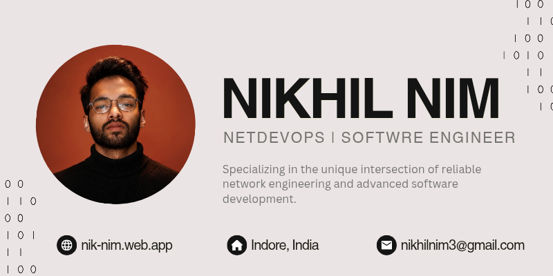

<!-- Hero Banner -->

  

<h1 align="center">
  Hi 👋 I'm Nikhil Nim
</h1>

<h3 align="center">
  🚀 NetDevOps Engineer • Python Automation Expert • Network Programmability Specialist
</h3>

  

  

  

  

---

## ⚡ About Me

- 🚀 Freelance IT Consultant
- 🌐 Enterprise Networking Specialist
- 🐍 Python Automation Expert
- ⚙️ Cisco NX-OS / IOS-XE Engineer
- 📡 YANG • NETCONF • RESTCONF
- 🔬 Embedded Systems & RF Research
- 🎯 Passionate about Network Automation

---

## 🛠 Tech Stack

### Networking

---

## 💼 Experience

### Cisco Systems

🔹 Automated testing for NX-OS releases

🔹 MACsec, ICAM, NXAPI validation

🔹 YANG Suite & PyATS automation

---

### Cansvolution Pvt. Ltd.

🔹 Backend API Development

🔹 Database Architecture

🔹 Agile Product Delivery

---

### Freelance Consultant

🔹 Multi-vendor Network Deployments

🔹 Python-based Automation Frameworks

🔹 Infrastructure Optimization

---

## 🚀 Featured Projects

### 📡 RF Security & Wireless Analysis Platform

- ESP32 / ESP8266
- CC1101 + NRF24L01
- SPI / I2C
- OLED UI
- Packet Analysis & Wireless Testing

---

### 🚦 Smart Traffic Signal Using AI

- Computer Vision
- Dynamic Traffic Optimization
- Machine Learning
- Research Publication

---

## 📈 GitHub Analytics

---

## 📊 Activity Graph

---

## 🐍 Contribution Snake

---

## 🏆 Certifications

🏅 CCNA

🏅 Python Application Training

🏅 Google Networking

🏅 Microsoft MTA

---

## 🌎 Connect With Me

---

